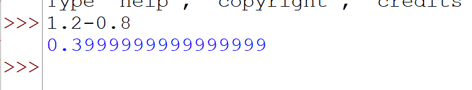
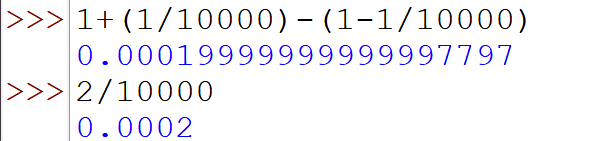
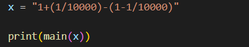
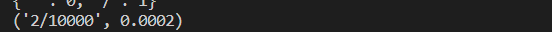

# Mathematical Expression solver with Python

One of the first things that you do when you start learning python or any other programming language is to solve small mathematical expressions. But you might have come across some results which are not quite accurate. For example, 1.2 - 0.8 = 0.4 but when you try this in python, the results are a little off.

Similarly if you try something like "1+(1/10000)-(1-1/10000)", the result should be 2/10000 = 0.0002 but,

This error is not a bug specific to pyton rather it is more on how the computer handles the floating point numbers. Whenever we pass these mathematical expressions, they are converted into binary numbers. As it is difficult to accuraltely represent some floating point numbers as binary, it causes small round off errors.

Also, mathermatical expressions are solved using 'PEMDAS' and left to right rule. So while solving an expression like the one above, python first solves the expressions in the brackets, converting **1/10000** and **1-1/10000** into floating point numbers and then proceeds with the further calculation. As these fractions are prematurely converted inot floating points, small roundoff errors are caused.

To minimize this problem, this program attempts to simplifies the expression as much as possible, and keeps the expression in fraction form till it is reduced to a single term.
The program checks if the brackets can be opened without calculating what is inside them, converts any decimal numbers to fractions, separates whole numbers and fractions and evaulates them while keepign them in fraction form. It outputs the answer in reduced fractional or whole number form of the expression as well as its decimal form which was evaluated at the very last step.

So for an expression like **1+(1/10000)-(1-1/10000)**, it opens paranthesis first, arranges the expression **(1-1+1/10000 +1/10000)** , evaluates the whole number part of the expression separately and the fractional part separately, producing the final expression **2/10000** and its respective decimal form **0.0002** as the output.

Output:

## Note:

This problem was inspired by the course [Advanced Learning Algorithms](https://www.coursera.org/learn/advanced-learning-algorithms) offered by DeepLearning.ai by Andrew Ng.

